### Why use SSHOperator instead of SparkSubmitOperator ?
Airflow offers a wrapper operator around spark-submit known as SparkSubmitOperator. A pre-requisite for using SparkSubmitOperator is to have spark binaries installed on Airflow worker nodes, that is because when we use SparkSubmitOperator to submit PySpark jobs from Airflow to Spark clusters, the Airflow worker node acts like a Spark client. This approach is good if we are using deploy-mode as cluster to submit the Spark job, as the driver starts in one of the worker nodes inside the Spark cluster and Airflow can just monitor the job. 

But as per the official [Spark documentation][spark-standalone-doc], we cannot submit PySpark applications to a Spark standalone cluster in cluster deployment mode. Only client deployment mode is possible.

>Currently, the standalone mode does not support cluster mode for Python applications.

This means if we are writing a Spark application using Python and have a standalone Spark cluster running in Docker, we need to use the client deploy-mode to submit jobs. In this case, the spark driver will start in the Airflow node and utilize airflow resources. This driver program will also generate driver and application logs in the Airflow node.

This coupling between Airflow and Spark is not favorable and I wanted my Airflow and Spark applications to be independent. That is when I came across the SSHOperator in one of the StackOverflow answers, but I couldn't find many blogs explaining how to set up the ssh connection between airflow and spark cluster especially when they were running in docker containers, hence this project. I have tried to explain the project in this readme.

### What is an SSHOperator in Airflow

From the official [SSHOperator Airflow document][sshoperator-airflow-doc]
>SSHOperator to execute commands on given remote host using the ssh_hook.

Basically, we ssh from an Airflow worker node into a Spark worker node (or a spark edge or client node if you have one) and submit Spark jobs from here. This way the binaries and the services required will only need to run on the Spark worker node and airflow can just monitor the job.

### Approach

There are six parts to this project:
1.   Creating a Docker network for Airflow and Spark
2.   Starting Airflow and Spark cluster in Docker containers
3.   Creating Airflow UI SSH connection
4.   Installing Python SSH providers package
5.   Airflow dag and PySpark application script creation]
6.   Submitting Application

### 1. Creating docker network for airflow and spark

A docker container is an isolated system, but if they are inside a Docker network, they can reach each other using either the container name or service name, as the network's internal DNS server resolves these names to the container's IP address. As we need Airflow to ssh into the Spark cluster, we create an external Docker network and add Airflow and Spark Docker containers inside this network so that all containers are visible to the other. 

~~~ docker
docker network create --driver bridge airflow_spark_network
~~~

The above network is created using a default bridge network because I want all the containers to be isolated from the host ports.
You can see your created network with the following command.

~~~ docker
docker network ls
~~~
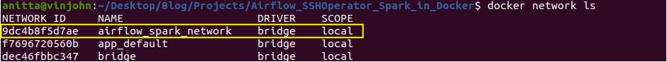

### 2. Starting Airflow and Spark in Docker containers

Airflow and Bitnami's Spark images have their official docker-compose files. Using them as a base, I have integrated both and made a few modifications to start some of the missing services required in the project. \
[Airflow image official docker-compose][airflow-source-docker-compose] \
[Bitnami's Spark image docker-compose][bitnami-docker-compose]

Following are some of the major modifications:

In Airflow
*   Changed CeleryExecutor to LocalExecutor
*   Extending Airflow image to generate ssh keys and a pip install statement to install any required Airflow provider packages or Python packages
*   Optimizing build by only building image in airflow-init service and using the reference of this image in the airflow-common YAML anchor
*   Changed airflow webserver port to 2000 as Spark web UI runs on 8080 (you can change this to your host port if 2000 is occupied, line 61 in the docker-compose file)
*   Added host.docker.internal host to all nodes as I am working on Ubuntu. If you are using Mac or Windows this was not needed
*   Added Postgres server and all Airflow nodes to the external network

In Spark
*   Extended Spark image to give password and name to the non-root user (Image uses 1001 uid for non-root, but to start history server and to ssh, we need to set a name to this uid and give it a password)
*   Optimized build by only building image in master and referencing this image in worker. Also added dependency of master for worker
*   Added host.docker.internal host to spark and worker nodes
*   Started history server on spark master node
*   As the application is going to run on spark workers, and the history server is on spark master, created a docker volume for Spark logs accessible to workers and spark master nodes
*   Many environment variables are set in Spark image using ENV of Dockerfile, so they are not stored anywhere like .bashrc or .profile files. 
Therefore, these variables will not be set in any ssh session to the worker nodes. As a remedy, created a file (/home/spark_user/docker_env.txt) which will have all the environment variables in the worker containers
*   Started ssh service on spark worker nodes 
*	Opened Spark Application web UI ports on Spark workers

*Note: Airflow image already has ssh client installed. Therefore, not installing ssh server in Airflow image as ssh client is sufficient for connecting to remote host.* 

#### Steps to setup environment and get the containers running

What we are trying to acheive :  

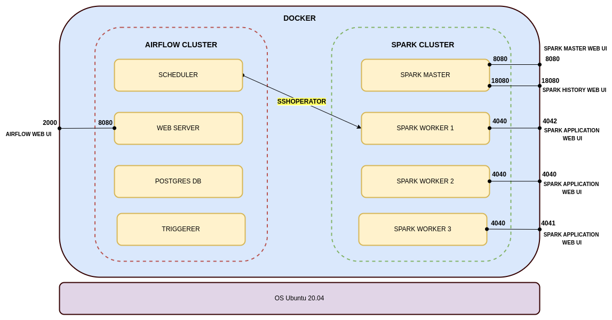

After cloning this project, run the following command in the **parent directory** (i.e where the docker-compose file is present).

1.  Airflow containers can run with the airflow user or your host's user. For this project, I wanted to run Airflow with the airflow user, so we need to set AIRFLOW_UID to 50000, which is the default airflow user's uid. Create the .env file with this info.

    ~~~ sh
    echo "AIRFLOW_UID=50000" > .env
    ~~~

2.  Change the group of all the files and directories to root if not already. 
    
    Most of the files on your host will have 661 access, i.e only my host user and its group members can access these files. When docker syncs these files from your host to containers, it retains the permissions, uid, and gid of the files. Your host uid will generally be 1000, but airflow uid is 50000 and spark_user is 1001. So, Airflow and Spark users will not be able to edit and read these files copied to containers via docker volume, thereby causing permission-denied errors. 

    Airflow and Spark users both belong to the root group (gid 0), and as docker retains the gid while copying files, if we change the gid of the host files to 0 i.e root, then our host user, airflow and spark user all belong to the same group and will be able to access each other's files.

    ~~~ sh
    #outside the parent directory

    #recursively change the group of all files and dir
    sudo chown -R :root Airflow_SSHOperator_Spark_in_Docker
    #to make sure new dir and files follow the same permissions
    sudo chmod g+s Airflow_SSHOperator_Spark_in_Docker
    ~~~

    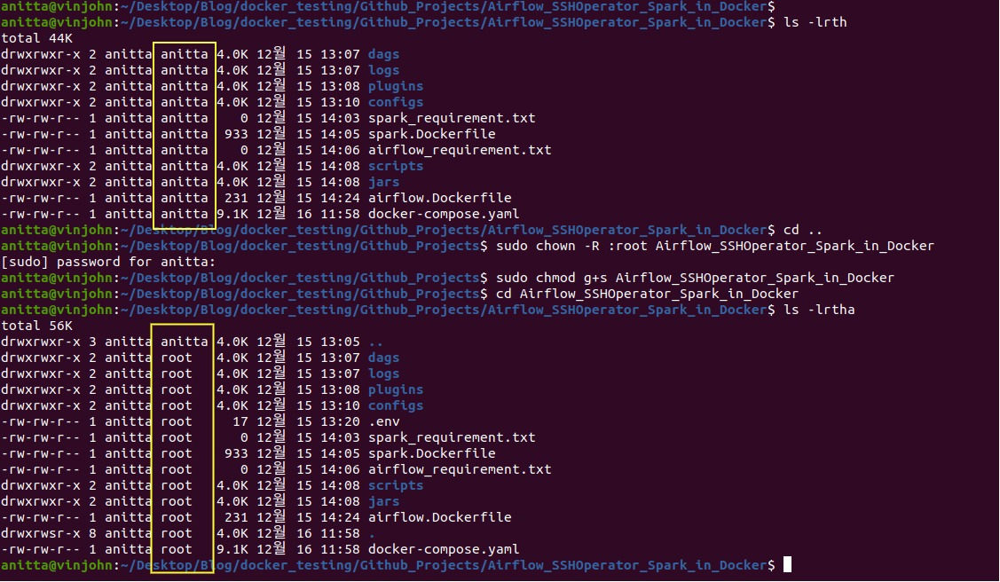

3.  Create a virtual env for airflow 

    An Airflow dag runs inside the Airflow Docker containers and the Python packages required are installed in the container itself. The airflow image already has Airflow and some provider packages installed, so we don't need to install these python packages locally. But it makes it easier to write the dags and for debugging. You can skip this step if want.

    *Note: The constraint file being used in the following code depends on your local Python version and the version of airflow you want to install. In my case, I have python3.8 installed and I am using an image with airflow 2.3.4. You can read more about this [here][airflow-constraint].*

    ~~~ sh
    unset PYTHONPATH; python3.8 -m venv airflow_venv
    source airflow_venv/bin/activate
    python3 -m pip install --upgrade pip
    pip install "apache-airflow==2.3.4" --constraint "https://raw.githubusercontent.com/apache/airflow/constraints-2.3.4/constraints-3.8.txt"
    ~~~

    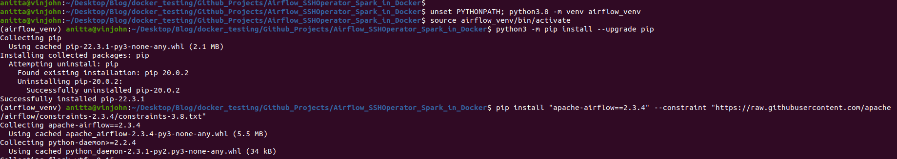

4.  Start the containers

    As we plan to start the driver program in one of the Spark worker nodes,  we need port 4040 (the application web UI ) of this spark-worker container bound to one of the host ports to see the application logs.
    
    This port mapping can be easily achieved if there is only one worker in our Spark cluster,  but if we want to scale up the number of workers by replicating the spark-worker service, binding one host port to the container port will cause a port conflict, as all the replicated containers will try to connect to the same host port. As a remedy, we need to specify a range of host ports for different spark-worker replicas to connect their port 4040.  
    
    For example, as I need 3 Spark workers, I have specified 4040-4042:4040 port mapping for spark-worker service in the docker-compose file. **Note that the order in which the ports are assigned is not in the order of the replication number. i.e spark-worker_1 might not be assigned to 4040.**
    
    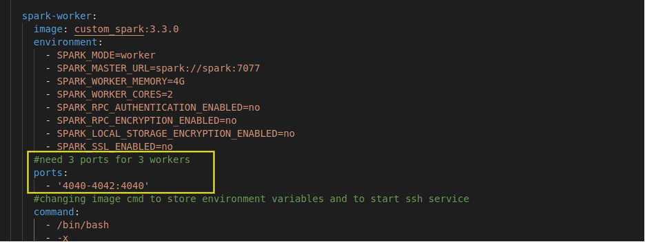
    
    First, start the airflow-init service to start Postgres DB and initialize airflow variables.  After that, start all the containers and as we want more than one spark worker,  use the scale option below.
    
    ~~~ sh
    docker-compose up airflow-init
    docker-compose up --scale spark-worker=3 -d
    ~~~
    
    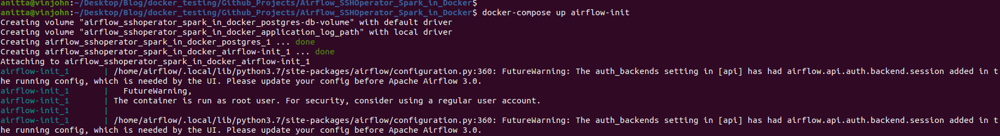
    
    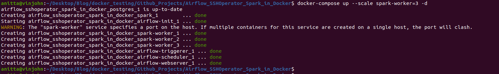

    Check if all the containers are running.
    
    ~~~ sh
    docker-compose ps
    ~~~
    
    
    
    Here you can see that spark-worker_1 is binded to port **4042**.
    Check if all containers belong to same network using the following command

    ~~~ sh
    docker network inspect airflow_spark_network
    ~~~

5.  Copying airflow public key to Spark worker node

    Alternatively, you can skip this step and just provide the spark_user password for authorizing the ssh connection instead of the ssh keys in the later stages

    ~~~ sh
    #we need to log in as airflow to do this
    docker exec -it -u airflow airflow_sshoperator_spark_in_docker_airflow-scheduler_1 bash
    ssh-copy-id -i /home/airflow/.ssh/id_ecdsa.pub spark_user@airflow_sshoperator_spark_in_docker_spark-worker_1
    #this will ask for the spark_user password. It is Spark123@. This has been set in the spark.Dockerfile
    #execute for other workers if you going to use them as clients
    ~~~

    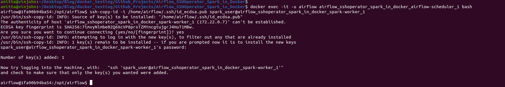

    Check spark worker to see if this airflow node is added as an authorized host

    ~~~ sh
    docker exec -it airflow_sshoperator_spark_in_docker_spark-worker_1 bash
    cd /home/spark_user/.ssh
    grep "airflow" authorized_keys
    ~~~

    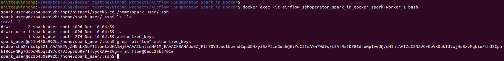    

6.  Change spark-default.conf if needed
    
    Local configs dir has the spark-default.conf for your spark application. As it has been bound to the spark clusters spark-default.conf, any changes made here would be reflected in the cluster. 

    I have already added some spark properties for the histroy server and logs. You can change them as per your needs

    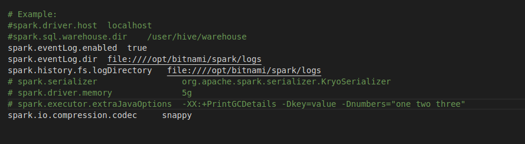 

All your applications are up and running now, here is a summary of them:

Platforms used
*   Airflow 2.3.4 
*   Spark 3.3.0

Web UI
*   ***Spark Master Web UI***: localhost:8080
*   ***Spark History Server***: localhost:18080
*   ***Spark Application UI***: localhost:4042 (this port will change depending on which port is bound to spark-worker_1)
*   ***Airflow Web UI***: localhost:2000   (username and password is airflow)

Users and their passwords
*   ***user***:airflow, ***password***:   airflow
*   ***user***:spark_user, ***password***:   Spark123@

Local directory and file usage

*   ***dags***:   create airflow dags here
*   ***logs***:   airflow dag run logs
*   ***jars***:   is binded to /opt/bitnami/spark/dev/jars of all spark workers. Keep jars needed for PySpark here
*   ***scripts***:    is binded to /opt/bitnami/spark/dev/scripts of all spark workers. Keep PySpark scripts here
*   ***configs***:    has the spark cluster spark-default.conf
*   ***spark_requirement.txt***:  place any python package you want to install on all Spark cluster nodes
*   ***airflow_requirement.txt***:    place any python packages you want to install on all Airflow cluster nodes

### 3.   Creating Airflow UI SSH connection

Follow the below steps to set up ssh connection from Airflow to Spark worker1. 

1.  Go to Airflow Web UI -> Admin menu -> Connections 
2.  Click on the + button to add a new connection
3.  Make the entries as explained in the below image and click on save

[SSH connection API documentation][airflow-ssh-conn-docs]

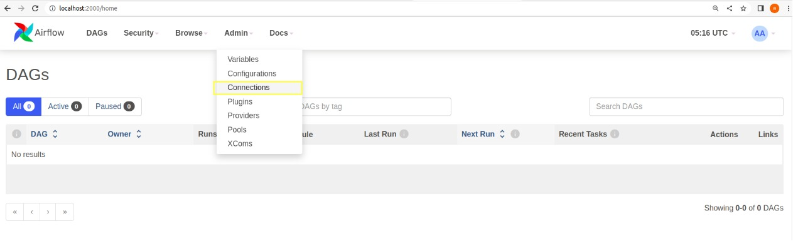 

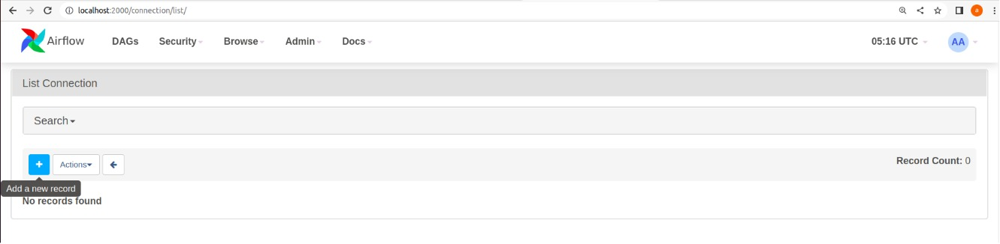 

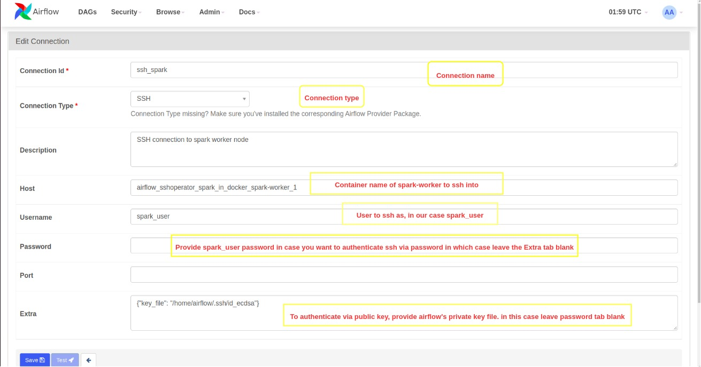 

### 4. Installing python SSH providers package

For using SSHOperator, we need the apache-airflow-providers-ssh package installed locally and in the airflow worker nodes (local installation is not necessary, just good for debugging your code), but this package is not part of the basic airflow installation.

The airflow docker image comes with some provider packages pre-installed. First, let's check if apache-airflow-providers-ssh is installed in the Airflow scheduler container (I am checking the scheduler node because I am using LocalExecutor, if you are using CeleryExecutor then you probably have to check the airflow worker nodes).

~~~ sh
docker exec -it -u airflow airflow_sshoperator_spark_in_docker_airflow-scheduler_1 bash
pip list | grep ssh
~~~

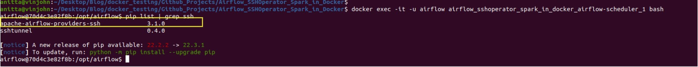 

If the apache-airflow-providers-ssh package is already installed, get the version (in my case 3.1.0) and install the same in your local virtual environment.

~~~ sh
source airflow_venv/bin/activate
python3 -m pip install apache-airflow-providers-ssh==3.1.0
deactivate
~~~

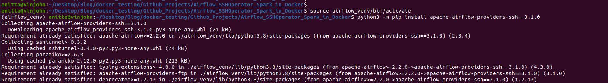 

In case the apache-airflow-providers-ssh package is not present in the Airflow scheduler node, then add the following in airflow_requirement.txt and then restart all the containers again. You should be able to see the package in the scheduler node now.

Paste this inside airflow_requirement.txt
~~~ .txt
apache-airflow-providers-ssh==3.1.0
~~~

Execute the following commands to restart all containers
~~~ sh
docker-compose down
docker-compose up airflow-init
docker-compose up --scale spark-worker=3 -d
~~~

### 5.  Airflow dag and Pyspark application script creation

The sample PySpark script in the local scripts folder reads the CSV file present there and writes it into a MySQL database table. So for this example, I need to create a MySQL connection in Airflow Connections UI.

As Airflow runs inside Docker container, it needs my local host's IP address to connect to MySQL locally running on port 1000 (localhost:1000). This is because if we mention localhost:1000 to Airflow as MySQL connection URL, it will take it to be 127.0.0.1 which is the Airflow docker container's IP address for itself. 

Here, host.docker.internal is a hostname that comes to our rescue. This is a special DNS name that gets resolved into our local host's IP address. You can read more about it [here][host-docker-internal]. So in the host tab in the connections UI, we have to use host.docker.internal (I have added this host in all containers though docker-compose, needed only for ubuntu)

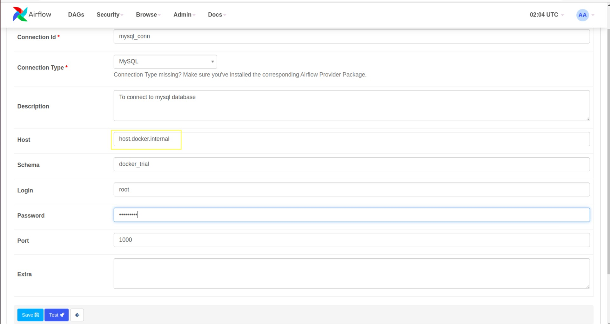 

As Spark submission happens inside the worker node and searches the worker's folders, any files or objects used in the PySpark application should also be present in the worker node and they should be referenced using the worker's folder structure.

Somethings I want to highlight:

1.  As mentioned earlier, when we start an ssh session on a Spark worker node, this session doesn't have all the environment variables set. So, we need to source the docker_env.txt (created during container creation time) to set all the environment variables in the ssh session before running the spark-submit command in the airflow dag.

    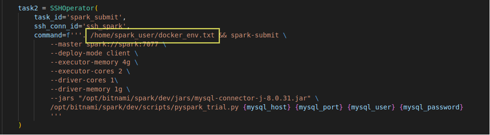 
    
2.  spark-submit command :
    *   As we are trying to connect to the MySQL server from PySpark, we need the MySQL JDBC driver jar. I have kept this jar in the local jars folder which is bound to spark worker nodes /opt/bitnami/spark/dev/jars path as explained before. So while doing spark-submit, I am sending the worker's jar path to the PySpark application.
    *   I am using Basehook to get MySQL connection from Airflow and then passing it as arguments to the PySpark application. 
    *   Spark master is reachable at spark://spark:7077 for spark worker nodes. In the docker-compose, the Spark master has spark as the service name
    *   In the docker-compose file, we can see the memory and core settings for worker nodes, change them as per your requirement and then make corresponding changes to the executor and driver memory/core settings in the spark-submit or spark-default.conf.

    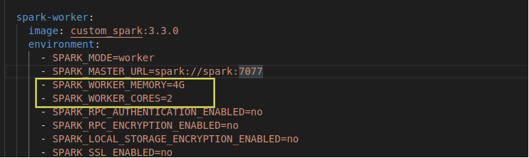 

3.  In PySpark script:
    *   CSV file path is of the Spark worker and is the path bound to the scripts local directory
    *   I already have a database (docker_trial) and a table (spark_table) created in MySQL database
        ~~~ SQL
        create database docker_trial;
        use docker_trial;
        create table spark_table (A int, B int, C int);
        ~~~
    * Similarly, if you want to add any python packages for your PySpark script, you can add the package name and version in the spark_requirement.txt and restart the containers. In my case, pandas were already there in the spark worker, so my spark_requirement.txt file is blank.

### 6. Submitting Application

After following the above steps, you should be able to see the sample dag in Airflow UI.
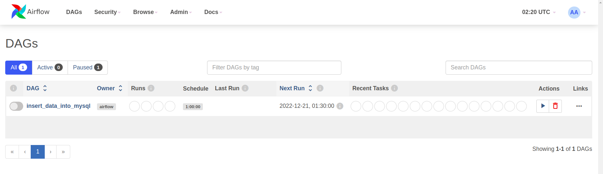 

Start the dag by unpausing it. As catchup is set to false, if the dag goes live after the start time, one run should be triggered 

Successful run image
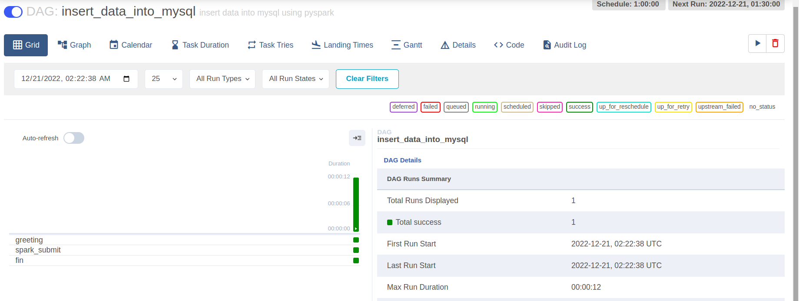 

Task1 logs will print the user running as airflow. From the below screenshot, you can see *** which is airflow. airflow is replaced with asterisks because it is also a password. 
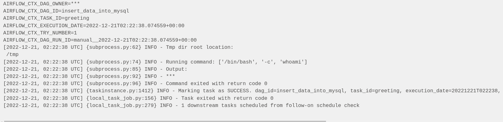 

From the below screenshot, you can see that ssh authentication was successful using the public key, and the Spark application was successfully submitted.
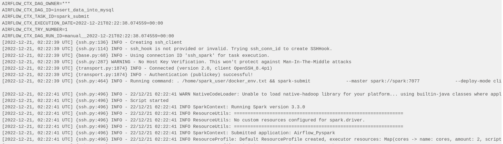 

Spark Master Web UI application competition status
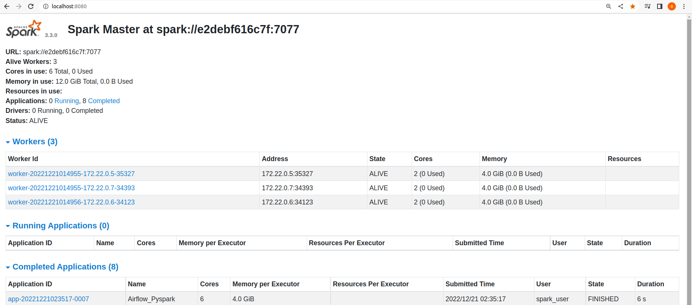 

Spark Application Web UI
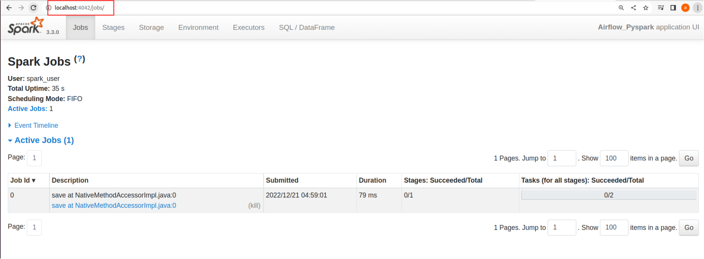 

The completion logs from the history server
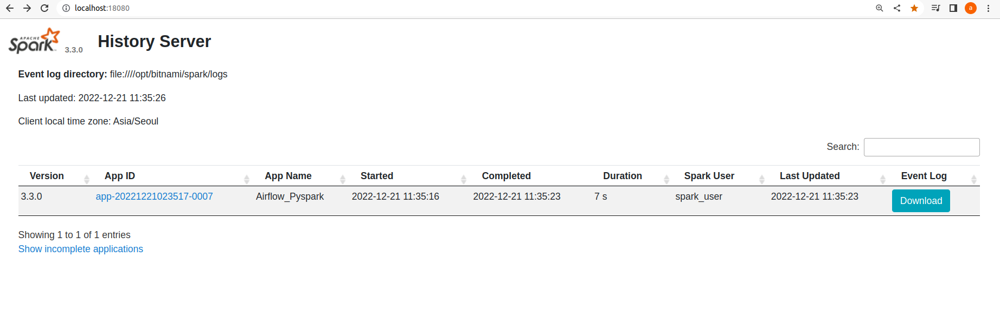 

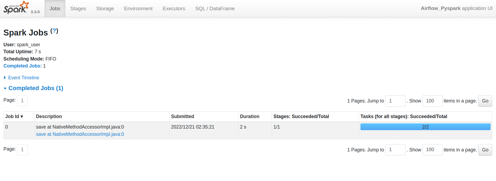 

Successful data insert into MySQL table
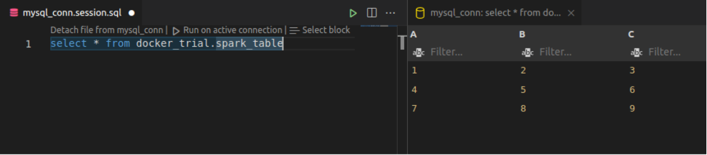 

### Conclusion

I hope you found this pr0ject helpful. 

[spark-standalone-doc]: https://spark.apache.org/docs/latest/submitting-applications.html#:~:text=Currently%2C%20the%20standalone%20mode%20does%20not%20support%20cluster%20mode%20for%20Python%20applications.

[sshoperator-airflow-doc]: https://airflow.apache.org/docs/apache-airflow-providers-ssh/stable/_api/airflow/providers/ssh/operators/ssh/index.html#airflow.providers.ssh.operators.ssh.SSHOperator

[airflow-source-docker-compose]: https://airflow.apache.org/docs/apache-airflow/2.3.4/start/docker.html#:~:text=curl%20%2DLfO%20%27https%3A//airflow.apache.org/docs/apache%2Dairflow/2.3.4/docker%2Dcompose.yaml%27

[bitnami-docker-compose]: https://hub.docker.com/r/bitnami/spark#:~:text=curl%20%2DLO%20https%3A//raw.githubusercontent.com/bitnami/containers/main/bitnami/spark/docker%2Dcompose.yml

[airflow-constraint]: https://airflow.apache.org/docs/apache-airflow/stable/installation/installing-from-pypi.html#:~:text=the%20template%20below.-,https%3A//raw.githubusercontent.com/apache/airflow/constraints%2D%24%7BAIRFLOW_VERSION%7D/constraints%2D%24%7BPYTHON_VERSION%7D.txt,-where%3A

[airflow-ssh-conn-docs]: https://airflow.apache.org/docs/apache-airflow-providers-ssh/stable/connections/ssh.html

[host-docker-internal]: https://docs.docker.com/desktop/networking/#:~:text=The%20host%20has,of%20Docker%20Desktop.

[github-repo]: https://github.com/anittasaju1996/MyProjects/tree/master/Airflow_SSHOperator_Spark_in_Docker

